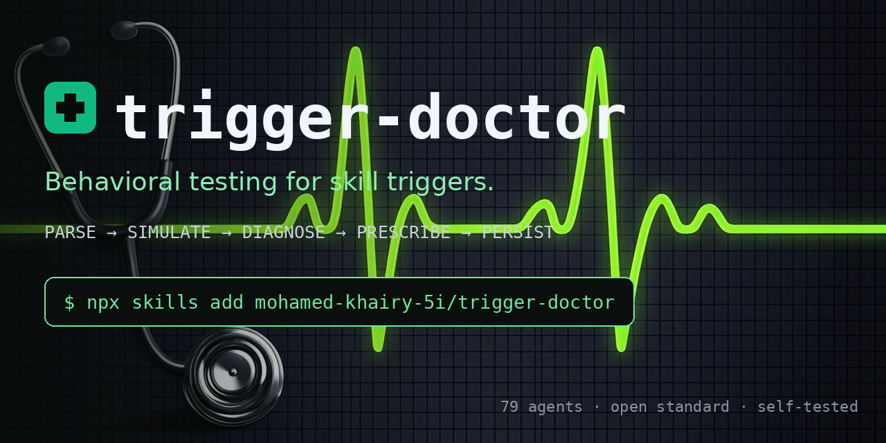

<h1>
   trigger-doctor
</h1>

<p>🩺 <b>Diagnose your agent skills</b> — behavioral testing, prescriptions and regression suites</p>

<p align="center">
  <a href="LICENSE"></a>&nbsp;
  &nbsp;
  &nbsp;
  &nbsp;
  <a href="https://github.com/mohamed-khairy-5i/trigger-doctor/actions/workflows/ci.yml"></a>
</p>

**Behavioral testing for skill triggers.** Most skills don't die of broken
logic — they die of never being opened. The `description` field is the gate
agents use to decide whether to load a skill, and almost nobody tests it.

trigger-doctor is an open-source [Agent Skills](https://agentskills.io) skill
that diagnoses whether another skill will actually trigger, finds *why* it
doesn't, prescribes a fixed description, and saves a regression suite you
re-run after every model update. It works with any runtime that follows the
open standard — **one `SKILL.md`, 79 agents** (Claude Code, Hermes, Codex,
Cursor, Gemini CLI, GitHub Copilot, …).

<div align="center">
  
</div>

---

## Quick start

```bash
npx skills add mohamed-khairy-5i/trigger-doctor
```

One command installs it for **all 79 agents** — the CLI knows each agent's
skills directory. Then ask your agent: *"check my skill"*.

**Where it lands (global):**

| Agent | Directory |
|---|---|
| Claude Code | `~/.claude/skills/trigger-doctor/` |
| Hermes Agent | `~/.hermes/skills/trigger-doctor/` |
| Codex | `~/.codex/skills/trigger-doctor/` |
| Cursor | `~/.cursor/skills/trigger-doctor/` |
| Gemini CLI | `~/.gemini/skills/trigger-doctor/` |
| GitHub Copilot | `~/.copilot/skills/trigger-doctor/` |

- Only specific agents: append `-a claude-code -a hermes-agent`
- **Manual install:** copy this folder into your agent's skills directory

## Why it's different

| | Static linters (skill-doctor etc.) | **trigger-doctor** |
|---|---|---|
| Mechanical checks (limits, frontmatter) | ✅ | ✅ `scripts/parse_skill.py` |
| Behavioral test ("would it fire for *this* utterance?") | ❌ needs a live agent | ✅ the agent judges its own gate |
| Treatment | ❌ grades only | ✅ ready-to-paste rewritten description |
| Regression | ❌ | ✅ labeled suite saved in git, re-run after model updates |
| Scope | one platform | ✅ any [Agent Skills](https://agentskills.io) runtime (79 agents via `npx skills add`) |

The behavioral layer is the moat: only a skill **inside** an agent can
simulate the agent's own trigger decision.

## The 8 failure modes it diagnoses

Every simulation failure maps to a named, fixable principle from
[`references/trigger-science.md`](references/trigger-science.md) —
**under-triggering** (the skill never fires) and **over-triggering**
(the skill hijacks conversations it shouldn't):

| ID | Name | Class | Fix |
|---|---|---|---|
| P1 | Shy Description | under | add imperative `Use this skill when...` |
| P2 | Implementation-Speak | under | describe *when*, not *how* |
| P3 | Vocabulary Gap | under | quote the user's real phrases |
| P4 | Implicit Domain | under | claim utterances that never name the domain |
| P5 | Budget Cut | under | front-load cues inside the 1024-char limit |
| P6 | No Boundary | over | add one `Do not use for...` line |
| P7 | Broad Nouns | over | qualify every generic "test/check/improve" |
| P8 | Hijack Risk | over | respect the simple-task exemption |

## The protocol

`SKILL.md` runs a 5-phase loop — **PARSE → SIMULATE → DIAGNOSE → PRESCRIBE → PERSIST**:

1. **PARSE** — `scripts/parse_skill.py` validates structure mechanically
   (frontmatter, 1024-char description budget, trigger/boundary phrasing,
   progressive disclosure, dangling references). Stdlib-only, exit code
   CI-friendly.
2. **SIMULATE** — a labeled suite (`{"query", "should_trigger"}` — the
   official eval format) is judged honestly against `name` + `description`
   only, with `borderline` allowed for simple tasks.
3. **DIAGNOSE** — every failure maps to a named principle
   (P1 Shy Description, P3 Vocabulary Gap, P6 No Boundary...) from
   `references/trigger-science.md`.
4. **PRESCRIBE** — a rewritten, copy-paste-ready description with
   BEFORE/AFTER character counts.
5. **PERSIST** — the suite is saved to `suites/<skill-name>.json`; future
   runs diff against it and flag flipped verdicts.

## Self-testing

The first patient is the doctor itself: `suites/trigger-doctor.json`
(12 cases — 8 positive, 4 negative) guards trigger-doctor's own description.
A real worked report from that self-test lives in
[`examples/example-report.md`](examples/example-report.md).

## FAQ

**Why doesn't my skill ever trigger?**
Almost always the description: no imperative `Use this skill when...` cues,
none of the user's actual words, no proactive claim. trigger-doctor
classifies it (P1, P2, P3, P4) and hands you a rewritten description.

**Why does my skill trigger too often?**
A missing boundary. One `Do not use for...` line fixes over-triggering
(P6, P7, P8) and stops the skill from hijacking adjacent tools.

**Is this just a linter?**
No. Linters grade text mechanics. trigger-doctor simulates the agent's own
trigger decision against a labeled test suite — the official eval format —
then treats what it finds and remembers it as a regression suite.

**Does it change my skill?**
No. It prescribes a copy-paste-ready description and saves a suite; you
decide what to apply.

## Honesty rule

Reports are a **simulation** of trigger judgment, not a runtime guarantee.
Every report says so. For runtime proof, install the skill and try it live.

## License

MIT — see [LICENSE](LICENSE).
